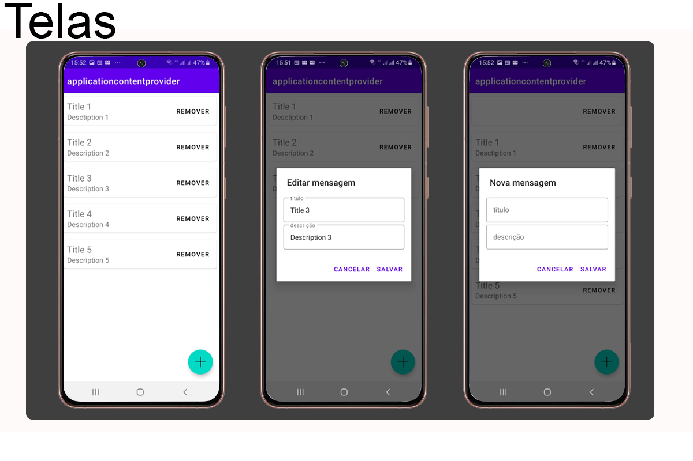

# ContentProvider App in Kotlin

Hello welcome

This was another one of everis Bootcamp modules at DIO.

This app was developed as an exercise for developing a Content Provider.

This one can add, update and change data on one ContentProvided.

Please feel free to look open to tips and suggestion

# Screens

